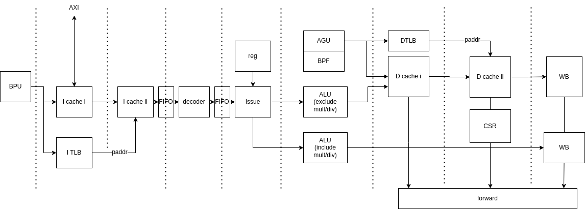

# simple_loong_cpu

NSCSCC 2023 Lain Core 项目 初赛提交cpu核心。

核心采用8级静态流水非对称双发射结构，支持loongarch 32 reduced指令集除浮点指令外所有指令

## 架构设计



## 目录结构

- rtl：存放所有模块rtl代码
  - 部分基础模块配有verlator testbench，用于单元测试
- src：存放所有非rtl的辅助代码
  - compile_project.py：项目“编译”脚本
  - compile_settings.json：模块版本配置
  - inst：用于生成解码器、定制流水信号
    - gen_decoder.py：生成decoder.sv/svh
    - 各json配置文件
  - setup：起系统命令
- doc：存放参考资料以及模块设计文档
- bits：存放各阶段比特流
- dist：由 compile_project.py 生成，根据配置生成的可用核心rtl

关于分支：

- stable/precompletecation：5826cf23检出，不带bpu的版本，初赛提交
- test-rebase-add_bpu：5826cf23检出，带bpu的版本
- lain_backend：持续开发，后接 [complex_loong_cpu](https://github.com/LainChip/complex_loong_cpu)


## 构建与仿真

项目整体构建：

- `compile_settings.json` 中对多版本模块进行选择，单版本模块默认选中
  - 识别方式：模块中包含注释诸如`/*--JSON--{"module_name":"mycpu_top","module_ver":"2","module_type":"module"}--JSON--*/`
- 执行`python compile_project.py`
  - 若shell中未设置 `CHIPLAB_HOME` 变量：创建dist目录并将所选模块拷贝至其中，方便vivado项目引用；
  - 若shell已设置 `CHIPLAB_HOME` （本地chiplab项目地址）：将所选模块拷贝至 `${CHIPLAB_HOME}/IP/myCPU/`目录中，方便chiplab使用；

基础模块单元测试：

- 进入模块所在目录，`make`编译并仿真
- 若initial块中dump了波形，仿真后可 `make wave` 查看波形（本项目使用gtkwave软件）

```verilog
initial begin
    $dumpfile("logs/vlt_dump.vcd");
    $dumpvars();
end
```


## 参考资料

见 [complex_loong_cpu](https://github.com/LainChip/complex_loong_cpu)
