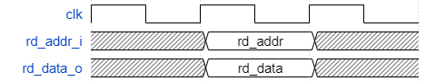
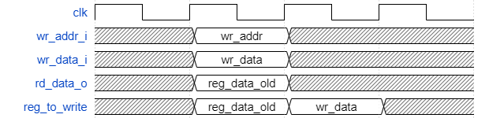

# csr模块文档

csr模块是一系列控制状态寄存器（Control and Status Register）。

该模块负责进行中断异常处理，描述cpu状态，为特权指令提供支持。

## 模块定义

```systemverilog
module csr(
    input           clk,
    input           rst_n,
    
    input   logic                   stall_pipe_i   //输入：流水线暂停
    input   logic   [25:0]          instr_i,       //输入：指令后26位

    //for read
    input   logic   [13:0]          rd_addr_i,     //输入：读csr寄存器编号
    output  logic   [31:0]          rd_data_o,    //输出：读数据
    
    // for write
    input   logic                   csr_write_en_i,       //输入：csr写使能
    input   logic   [13:0]          wr_addr_i,     //输入：写csr寄存器编号
    input   logic   [31:0]          wr_data_i      //输入：写数据
    input   logic   [31:0]          wr_mask_i      //输入：rj寄存器存放的写掩码

    //for interrupt
    input   logic   [8:0]           interrupt_i     //输入：中断信号

    //for exception
    input   logic   [5:0][1:0]      ecode_i         //输入：两条流水线的例外一级码
    input   logic   [8:0][1:0]      esubcode_i      //输入：两条流水线的例外二级码
    input   logic   [1:0]           excp_trigger_i  //输入：发生异常的流水级
    input   logic   [32:0][1:0]     bad_va_i        //输入：地址相关例外出错的虚地址
    input   logic   [32:0][1:0]     instr_pc_i      //输入：指令pc
    input   logic   [1:0]           do_ertn_i       //输入：两条流水线的例外返回
    output  logic                   do_redirect_o   //输出：是否发生跳转
    output  logic   [31:0]          redirect_addr_o //输出：返回或跳转的地址
    //todo：tlb related exceptions

    // timer
    output  logic  [63:0]  timer_data_o         //输出：定时器值
    output  logic  [31:0]  tid_o                //输出：定时器id

    //todo: llbit
    //todo: tlb related addr translate

);
```

## 模块时序说明

### 读csr

```json
{
    {
    signal: [
    {name: 'clk',        wave: 'p..'},
      {name: 'rd_addr_i',  wave: 'x2x', data:["rd_addr"]},
      {name: 'rd_data_o',  wave: 'x2x', data:["rd_data"]}
    ],
    config:{hscale:3}
}
}
```


### 写csr

```json
{
    signal: [
    {name: 'clk',        wave: 'p...'},
      {name: 'wr_addr_i',  wave: 'x2xx', data:["wr_addr"]},
      {name: 'wr_data_i',  wave: 'x2xx', data:["wr_data"]},
      {name: 'rd_data_o',  wave: 'x2xx', data:["reg_data_old"]},
      {name: 'reg_to_write',  wave: 'x22x', data:["reg_data_old", "wr_data"]},
    ],
  config:{hscale:3}
}
```



### todo
中断响应， 例外响应，例外返回