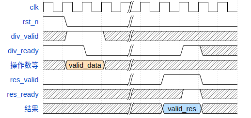

# divider模块文档

基4整数除法器（算不算SRT呢），来自tyh的设计；对于除数为0的情况尚未优化

## 模块定义

加入了显示的握手信号，而非先前的busy，应该有益无害吧

```systemverilog
module divider (
    input clk,
    input rst_n,    // 0：强制清空，divider回到空闲状态

    /* slave端的握手信号 */
    input  div_valid,   // 1：master端准备的数据有效
    output div_ready,   // 1：divider可以接受数据
    output res_valid,   // 1：divider产出有效结果
    input  res_ready,   // 1：master端可以接收结果

    input  div_signed_i,    // 有无符号
    input  [31:0] Z_i,      // 被除数
    input  [31:0] D_i,      // 除数
    output [31:0] q_o, s_o  // 商，余数
);
```

## 模块行为描述

正常的不定多周期除法器，最差为16周期。（待优化，基16？）

仿照axi总线协议，加入了两对握手信号，用以和上级模块交互。

关于有符号除法，规则如下：
| 被除数 | 除数 | 商 | 余数 |
| -- | -- | -- | -- |
| + | + | + | + |
| + | - | - | + |
| - | + | - | - |
| - | - | + | - |

## 模块新增类型

无

## 模块时序说明

关于握手信号，在时钟上升沿时：
- 若`div_ready`为1，则表明除法器准备就绪；此时若有`div_valid`为1，则除法器从当周期开始运作。
- 若`res_valid`为1，则表明计算完成结果可在当周期拿去使用；此时若`res_ready`为0，无法接受，则除法器会阻塞保持`res_valid`，直到拉高`res_ready`取走数据后的下一周期。

以下模拟演示一个基本的除法运算流程（`res_ready`迟到1周期）

```json
{
    signal: [
    {name: 'clk',        wave: 'p...|.....'},
    {name: 'rst_n',      wave: '10..|.....'},
    {name: 'div_valid',  wave: 'x1.x|.....'},
    {name: 'div_ready',  wave: '1.0.|..1x.'},
    {name: '操作数等',   wave: 'x4.x|.....', data: ['valid_data']},
    {name: 'res_valid',  wave: '0...|.1.0.'},
    {name: 'res_ready',  wave: 'x...|..1x.'},
    {name: '结果',       wave: 'x...|.5.x.', data: ['valid_res']},
    ]
}
```



