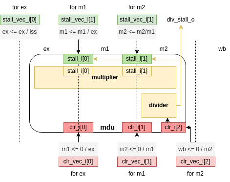

# mdu模块文档

包括multiplier和divider，即乘法器和除法器。

乘法器：32位有无符号共用乘法器，Booth两位乘（基4）算法，WallaceTree实现，x周期流水

除法器：32位有无符号共用除法器，SRT基4整数除法器，16周期内完成（除0就不送入除法器了，直接指令作废）

## 模块定义

```systemverilog
module mdu (
    input clk,
    input rst_n,
    
    input [1:0] stall_i,    // [0] for m1, [1] for m2
    input [2:0] clr_i,      // [0] for ex, [1] for m1, [2] for m2
    output div_busy_o,

    input decode_info_t decode_info_i,
    input [1:0][31:0] reg_fetch_i,
    output [31:0] mdu_res_o
);
```

## 模块行为描述

包装了乘除法器，流水级与pipeline并行（`ex | m1 | m2`）。

其中乘法指令在ex级输入乘法器，在m2级产生可用结果输出，暂停清空与pipeline同步；除法指令则流至m2级时输出触发器，经过若干拍的暂停（div_busy_o标识)得出可用结果。

具体流水寄存器控制信号与模块排布情况见下图：



## 模块新增类型

### mdu_flow_t

描述mdu内部流水的信号

```systemverilog
typedef struct packed {
    alu_type_t alu_type;
    opd_unsigned_t opd_unsigned;
    logic [31:0] mdu_opd1, mdu_opd2;
} mdu_flow_t;
```

## 模块时序说明