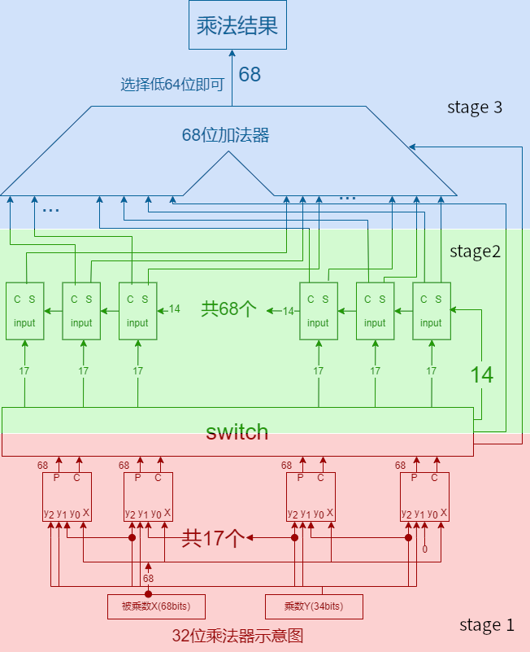
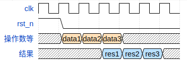

# multiplier模块文档

32位有无符号共用乘法器，Booth两位乘（基4）算法，WallaceTree实现，3级流水

## 模块定义

```systemverilog
module multiplier (
    input clk,
    input rst_n,

    input stall_i,  // 暂停信号，与核心流水线一致

    input mul_signed_i, // 有无符号
    input  [31:0] X_i,  // 被乘数
    input  [31:0] Y_i,  // 乘数
    output [63:0] res_o // 积
);
```

## 模块行为描述

将整体构造划分为3级流水（booth部分积 | wallace树 | 68位加法器），计划与核心流水线同步，ex级进入乘法器，经过m1级，在m2级获得结果；同步暂停

内部设计：实则为34位定点补码乘法器，可将有无符号统一。




## 模块新增类型

### mul_flow_t

描述乘法器内部流水的信号

```systemverilog
typedef struct packed {
    logic [16:0] booth_carry;
    logic [63:0] wallace_c, wallace_s;
} mul_flow_t;
```


## 模块时序说明

```json
{
    signal: [
    {name: 'clk',        wave: 'p......'},
    {name: 'rst_n',      wave: '10.....'},
    {name: '操作数等',   wave: 'x444x..', data: ['data1', 'data2', 'data3']},
    {name: '结果',       wave: 'x..555x', data: ['res1', 'res2', 'res3']},
    ]
}
```

